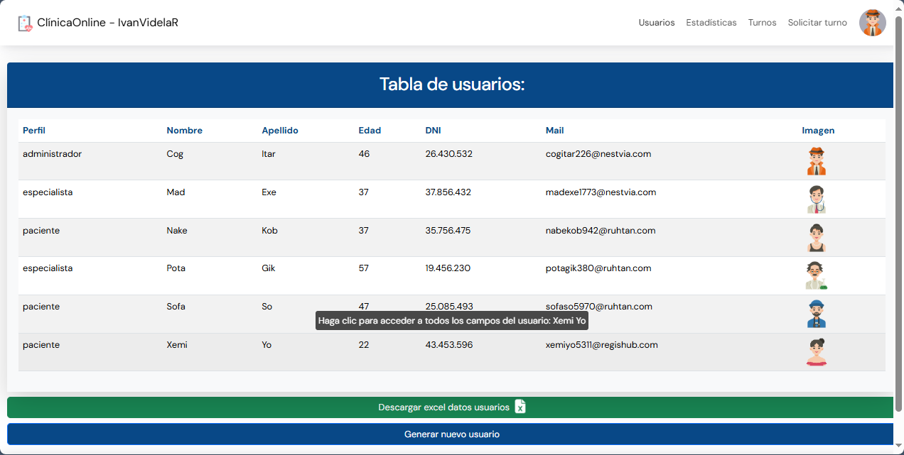

### Iván Agustín Videla Ribodino
### Hosting: [deploy](https://tp2-clinicaonline-ivanvidelar.web.app/)
### Sprints Completos Terminados: 
- 1
- 2

# TP CLINICA ONLINE

## Requerimientos de la aplicación

Nos piden realizar un sistema según las necesidades y deseos del cliente, para eso tenemos una breve descripción de lo que el cliente nos comenta acerca de su negocio: 

“La clínica OnLine, especialista en salud, cuenta actualmente con consultorios (6 en la actualidad),
dos laboratorios (físicos en la clínica), y una sala de espera general. Está abierta al público de lunes
a viernes en el horario de 8:00 a 19:00, y los sábados en el horario de 8:00 a 14:00.
Trabajan en ella profesionales de diversas especialidades, que ocupan los consultorios acorde a su
disponibilidad, y reciben en ellos pacientes con turno para consulta o tratamiento. Dichos turnos son
pedidos por la web seleccionando el profesional o la especialidad. La duración mínima de un turno
es 30 minutos.” pero los profesionales pueden cambiar la duración según su especialidad. Estos
profesionales pueden tener más de una especialidad.
También contamos con un sector dentro de la clínica que se encarga de la organización
y administración de la misma.

## Inicio

## Login

### Para loguearse de manera rápida:

### Para validar campos del login:

## Registro de Usuarios

### Selección de Perfil

### Registro de Paciente

### Registro de Especialista

### Para validar campos del registro:

## Perfil de Usuario

### Mi Perfil (Administrador)

### Mi Perfil (Especialista)

### Gestionar Horarios del Especialista

## Sección usuarios (Admin)

### Usuarios Administrados

### Generar un Usuario 

## Solicitar un Turno

### Formulario de Solicitud de Turno (Admin - Paso 1)

### Formulario de Solicitud de Turno (Admin - Paso 2)

### Formulario de Solicitud de Turno (Paciente - Paso 1)

### Formulario de Solicitud de Turno (Paciente - Paso 2)

## Gestión de Turnos

### Cancelar un Turno (Admin, Paciente y Especialista)

### Selección de Motivo de Cancelación de Turno (Admin, Paciente y Especialista)

### Ver reseña del mensaje que deja el especialista al finalizar el turno (Especialista y Paciente)

### Calificar un Turno (Paciente)!

### Completar Encuesta (Paciente)

### Visualización de Calificación (Paciente)

### Ver Encuesta Completa (Paciente)

### Aceptar un Turno (Especialista)

### Rechazar un Turno (Especialista)

### Finalizar un Turno (Especialista)

