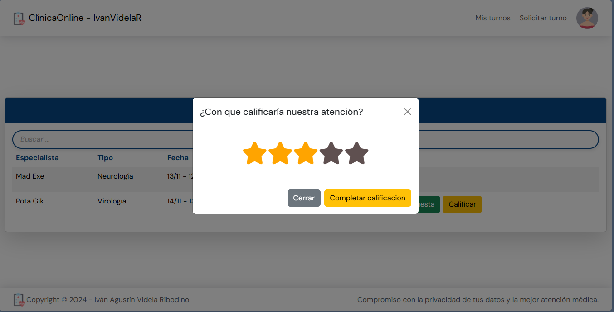

### Alumno: Iván Agustín Videla Ribodino
### Materia: Laboratorio de Computación IV
### Hosting: [deploy](https://tp2-clinicaonline-ivanvidelar.web.app/)

### Sprints Completos Terminados: 
- 1
- 2
- 3
- 4
# TP CLINICA ONLINE

## Requerimientos de la aplicación

Nos piden realizar un sistema según las necesidades y deseos del cliente, para eso tenemos una breve descripción de lo que el cliente nos comenta acerca de su negocio: 

“La clínica OnLine, especialista en salud, cuenta actualmente con consultorios (6 en la actualidad),
dos laboratorios (físicos en la clínica), y una sala de espera general. Está abierta al público de lunes
a viernes en el horario de 8:00 a 19:00, y los sábados en el horario de 8:00 a 14:00.
Trabajan en ella profesionales de diversas especialidades, que ocupan los consultorios acorde a su
disponibilidad, y reciben en ellos pacientes con turno para consulta o tratamiento. Dichos turnos son
pedidos por la web seleccionando el profesional o la especialidad. La duración mínima de un turno
es 30 minutos.” pero los profesionales pueden cambiar la duración según su especialidad. Estos
profesionales pueden tener más de una especialidad.

También contamos con un sector dentro de la clínica que se encarga de la organización
y administración de la misma.

## Resumen de funcionalidades por entregas (sprints)

### Sprint 1: Registro y Gestión de Usuarios
> [!NOTE]  
> En esta etapa implemente funcionalidades iniciales para la administración de usuarios y el acceso al sistema:

- Página de bienvenida: 
  - Incluye una bienvenida al sistema, accesos al login, registro y créditos al creador.
- Registro de usuarios:
  - Pacientes: Datos como nombre, apellido, edad, DNI, correo, contraseña, fotos de perfil y obra social.
  - Especialistas: Incluye datos básicos y la posibilidad de seleccionar/agregar especialidades.
  - Administradores: Solo pueden ser creados desde la sección de usuarios al generar un usuario.
  - Validaciones: Implementación de validaciones en todos los campos requeridos.
- Login:
  - Acceso al sistema con verificación de correo para Pacientes y necesidad de aprobación previa para Especialistas.
  - Botones de acceso rápido
  - Validaciones: Implementación de validaciones en todos los campos requeridos.
- Gestión de usuarios (Administrador):
  - Visualización y habilitación/inhabilitación de usuarios Especialistas.
  - Creación de nuevos usuarios con las mismas validaciones que el registro.

#### Requerimientos adicionales (agregados despues del sprint): 
- Registro de usuarios
  - Al ingresar a la página solo se deben ver 2 botones con la imagen que represente un paciente o especialista, según esa elección mostrará el formulario correspondiente.
  - Estas imagenes tienen que estar en botones rectangulares uno abajo del otro."
- Botones de Acceso rápido
  - Debe ser botones cuadrados
  - Debe tener la imagen de perfil del usuario
  - Debe estar a la izquierda del login uno abajo del otro 6 usuarios. (3 pacientes, 2 especialistas, 1 admin)

### Sprint 2: Turnos y Perfiles
> [!NOTE]  
> En esta etapa desarrolle funcionalidades relacionadas con la gestión de turnos:

- Mis Turnos:
  - Pacientes: Visualización de turnos solicitados, con acciones como ver reseña, cancelar, calificar o completar / ver encuestas según el estado del turno.
  - Especialistas: Gestión de turnos asignados, permitiendo aceptar, rechazar, cancelar o finalizar turnos, con reseñas asociadas.
- Turnos (Administrador): 
  - Visualización y gestión de turnos de la clínica con filtros específicos.
- Solicitud de Turnos:
  - Disponibilidad basada en especialidades, especialistas y fechas (sin datepickers).
  - Los administradores pueden asignar turnos para pacientes.
- Perfil de usuario:
  - Visualización de datos personales.
  - Disponibilidad horaria: Los especialistas pueden definir horarios relacionados con sus especialidades.
- Seguridad: 
  - Incorporación de captchas y validaciones adicionales.

#### Requerimientos adicionales (agregados despues del sprint): 
- Sacar un turno
  - Comienza mostrando las ESPECIALIDADES en botones con la imagen de la especialidad, en caso de no tener muestra imagen por default. Deben ser botones rectangulares sin el nombre de la especialidad
 - Una vez seleccionada mostrará los PROFESIONALES, en botones con la imagen de perfil de cada profesional y su nombre arriba de la foto. Estos botones deben ser rectangulares.

### Sprint 3: Historia Clínica y Mejoras de Funcionalidad
> [!NOTE]  
> Se añadieron nuevas funcionalidades relacionadas con las historias clínicas y filtros avanzados:

- Historia clínica:
  - Compuesta por datos fijos (altura, peso, temperatura, presión) y hasta tres datos dinámicos (clave/valor).
  - Pacientes: Visualización en "Mi Perfil".
  - Especialistas: Acceso a las historias de los pacientes que hayan atendido.
  - Administradores: Visualización desde la sección de usuarios.
- Filtros avanzados:
  - Búsqueda por cualquier campo, incluyendo datos de la historia clínica.
- Descargas:
  - Pacientes: PDF con historia clínica (incluye logo, título y fecha).
  - Administradores: Exportación de datos de usuarios en Excel.
- Interactividad:
  - Incorporación de al menos dos animaciones de transición entre componentes.

#### Requerimientos adicionales (agregados despues del sprint): 

- Sección Pacientes: 
  - Para los especialistas. Solo deberá mostrar los usuarios que el especialista haya atendido al menos 1 vez.
  - Mostrar los usuarios con un favbutton redondo , imagen y nombre, al seleccionar un paciente  se muestra los dellaes de los turnos y un acceso a la reseña  de cada consulta
- Sección usuarios: 
  - Solamente para el perfil Administrador, un excel con los datos de los usuarios.
  - Mostrar los usuarios con CARD y al seleccionarlo me descarga los datos de que turnos tomo y con quien.
- Mi perfil: 	
  - Para los usuarios paciente, un pdf con la historia clínica. 
  - El PDF tiene que tener logo de la clínica, título del informe y fecha de emisión."	
  - Poder bajar Todas las atenciones que realice segun un PROFESIONAL
- Animaciones: 	
  - Se debe agregar al menos 2, como mínimo, animaciones de transición entre componentes al navegar
  la aplicación.	
  - Una debe ser de Derecha a izquierda

### Sprint 4: Estadísticas y Gráficos
> [!NOTE]  
> Se desarrollaron herramientas de análisis y estadísticas para los administradores:

- Informes:
  - Log de ingresos al sistema (usuario, fecha y hora).
  - Cantidad de turnos por especialidad, por día y por médico (en un lapso de tiempo).
  - Turnos finalizados por médico en un lapso de tiempo.
- Visualización y exportación:
  - Gráficos dinámicos descargables en Excel o PDF.
  - Requerimientos adicionales:
    - Implementación de 3 pipes y 3 directivas personalizadas.

> [!IMPORTANT]  
> Este desarrollo asegura un sistema robusto y funcional que combina la gestión de usuarios, turnos, historias clínicas y análisis de datos, cumpliendo con las especificaciones iniciales del proyecto.

## Inicio

## Login

### Para loguearse de manera rápida:

### Para validar campos del login:

## Registro de Usuarios

### Selección de Perfil

### Registro de Paciente

### Registro de Especialista

### Para validar campos del registro:

## Perfil de Usuario

### Mi Perfil (Administrador)

### Mi Perfil (Especialista)

### Gestionar Horarios del Especialista

## Sección usuarios (Admin)

### Usuarios Administrados

### Generar un Usuario 

## Solicitar un Turno

### Formulario de Solicitud de Turno (Admin - Paso 1)

### Formulario de Solicitud de Turno (Admin - Paso 2)

### Formulario de Solicitud de Turno (Paciente - Paso 1)

### Formulario de Solicitud de Turno (Paciente - Paso 2)

## Gestión de Turnos

### Cancelar un Turno (Admin, Paciente y Especialista)

### Selección de Motivo de Cancelación de Turno (Admin, Paciente y Especialista)

### Ver reseña del mensaje que deja el especialista al finalizar el turno (Especialista y Paciente)

### Calificar un Turno (Paciente)!

### Completar Encuesta (Paciente)

### Visualización de Calificación (Paciente)

### Ver Encuesta Completa (Paciente)

### Aceptar un Turno (Especialista)

### Rechazar un Turno (Especialista)

### Finalizar un Turno (Especialista)

